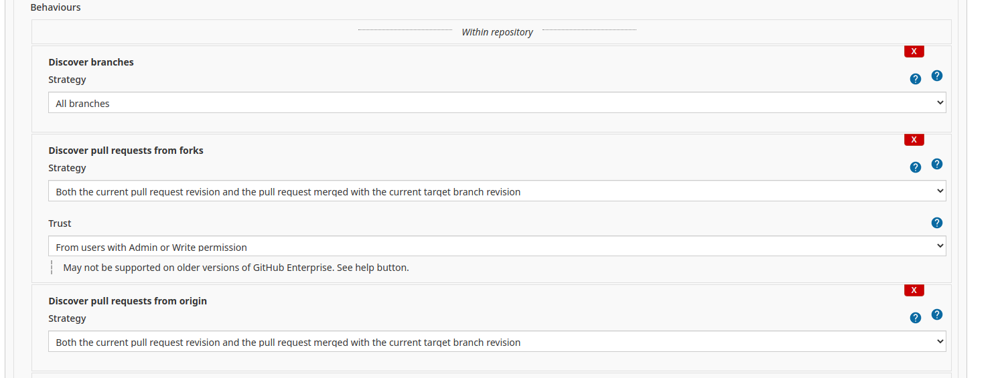
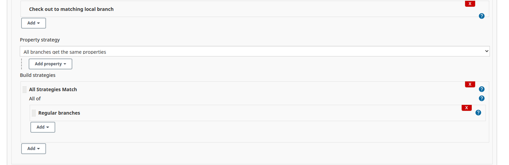

# SRE Orderbook application

Orderbook is a Java Spring Boot application used for training purposes.  It can be compiled using Maven;

## Building

```
$ mvn -Dmaven.test.skip=true clean package
```

It can also be compiled using the Maven container, see the [compose/Dockerfile.api](compose/Dockerfile.api), and the hub.docker.com image called maven:3.6.3-openjdk-11.

```
$ docker run -it --rm --name orderbook -v "$(pwd)":/usr/src/mymaven -w /usr/src/mymaven maven:3.3-jdk-8 mvn -Dmaven.test.skip=true clean package
```

## Building with docker-compose

If you have Docker and docker-compose installed on your system then you can launch the application locally on your system using;

```
$ docker-compose -d up
```

This will launch the environment as it would in Kubernetes with the Database, API/Web UI, automated client.

Once launched the application will be available at;

```
http://localhost:8080
```

If for any reasons you are already running something on port 8080 then edit the [**docker-compose.yml**](docker-compose.yml) file and change the following code;

```
ports:
  - "8080:8080"
```

Change the first 8080 to an available port on your system.

# Using the application

The application has an API and a Web front end.  The URLs of interest will show up if you go to;

```
localhost:8080
```

# SRE Orderbook pipeline build

This is an example build job for the orderbook application pipeline.  This branch contains the pipeline and docker configuration for the application and database.

The code in the [**Jenkinsfile**](Jenkinsfile) can be used in Jenkins through **Open Blue Ocean** plugin interface, or through the **multibranch pipeline**

## Setting Up Blue Ocean pipeline

This is documented in Day 1, Module 3 - Jenkins.pptx

After setting up the Multibranch pipeline it will do the first scan and build automatically, but it doesn't poll the SCM and automatically build if someone pushes to their branch.  For this to happen you need to;

1. Got to https://jenkins.computerlab.online/job/sre-orderbook
2. Click **Configure**
3. Scroll down to behaviours and set the information as follows;
   
4. Scroll down to **Property strategy** and make the following changes;
   
   NOTE: For this you will need to click **Add** under **Build strategies** and select **All Strategies Match** to get the first part.
